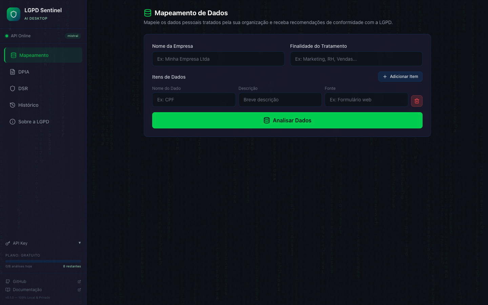
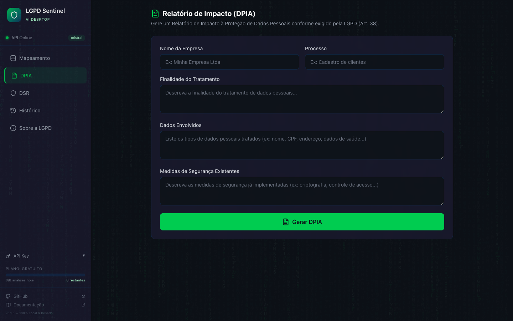
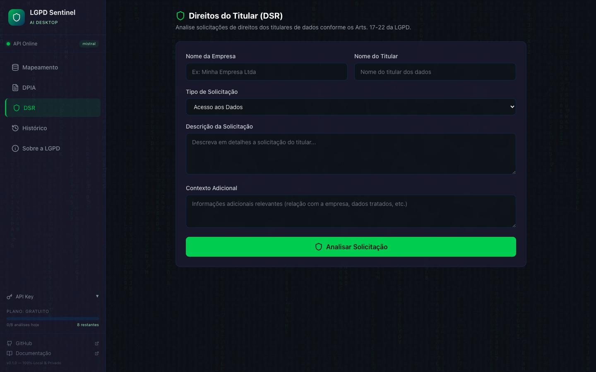
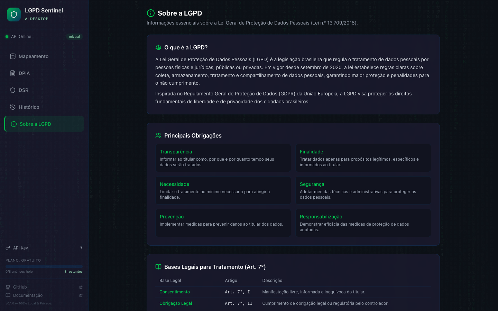

<div align="center">

[](https://opensource.org/licenses/Apache-2.0)
[](https://python.org)
[](https://fastapi.tiangolo.com)
[](./tests/)
[](http://makeapullrequest.com)
[](https://www.producthunt.com/posts/lgpd-sentinel-ai)
[](https://github.com/ldsjunior-ui/lgpd-sentinel-ai/stargazers)

# LGPD Sentinel AI 🛡️

> **Auditorias LGPD automatizadas com IA local — nenhum dado sai do seu servidor.**

**Se este projeto te ajuda ou te parece útil, uma ⭐ faz enorme diferença para o alcance do projeto!**
[](https://github.com/ldsjunior-ui/lgpd-sentinel-ai/stargazers)

</div>

Substitua dias de trabalho manual por minutos. O LGPD Sentinel AI gera **Data Mapping**, **RIPD/DPIA**, analisa **direitos dos titulares** e exporta relatórios em PDF — tudo rodando com IA 100% local via Ollama.

**Ideal para:** DPOs, jurídico, compliance, consultorias e times de desenvolvimento.

---

## 🖥️ Download — App Desktop (Novo!)

> **Baixe, instale e use. Sem terminal, sem Docker, sem complicação.**

[-000?style=for-the-badge&logo=apple&logoColor=white)](https://github.com/ldsjunior-ui/lgpd-sentinel-ai/releases/download/v1.0.1/LGPD.Sentinel.AI_1.0.0_aarch64.dmg)
[](https://github.com/ldsjunior-ui/lgpd-sentinel-ai/releases/download/v1.0.1/LGPD.Sentinel.AI_1.0.0_x64-setup.exe)
[](https://github.com/ldsjunior-ui/lgpd-sentinel-ai/releases/download/v1.0.1/LGPD.Sentinel.AI_1.0.0_amd64.AppImage)

**Como instalar:**
- **macOS:** Baixe o `.dmg` > arraste para Aplicativos > Ajustes > Privacidade > "Abrir Mesmo Assim"
- **Windows:** Baixe o `.exe` > execute o instalador > abra pelo Menu Iniciar
- **Linux:** Baixe o `.AppImage` > `chmod +x` > execute

**Requisitos:** macOS 10.15+ (Apple Silicon) · [Ollama](https://ollama.com) instalado · Python 3.11+

**8 análises gratuitas por dia. Sem cadastro. Sem cartão de crédito.**

---

## 📸 Screenshots

<div align="center">

| Mapeamento de Dados | DPIA / Relatório de Impacto |
|:---:|:---:|
|  |  |

| Direitos do Titular (DSR) | Sobre a LGPD |
|:---:|:---:|
|  |  |

</div>

---

## ⚡ O que ele faz em 60 segundos

```bash
docker compose up        # sobe API + IA (alternativa ao app desktop)
# acesse http://localhost:8501
```

1. Cole seus dados → recebe classificação LGPD + base legal
2. Descreva um tratamento → recebe RIPD completo em PDF
3. Recebe solicitação de titular → recebe resposta pronta (Art. 18)

---

## ✨ Funcionalidades

| Feature | O que entrega | Artigo LGPD |
|---|---|---|
| 📊 **Data Mapping** | Classifica dados pessoais/sensíveis, sugere base legal, score de conformidade 0-100 | Art. 5, 7, 11 |
| 🔍 **DPIA / RIPD** | Relatório de Impacto completo com riscos, medidas de mitigação e PDF pronto para ANPD | Art. 38 |
| 📝 **DSR** | Analisa os 8 direitos do titular (acesso, exclusão, portabilidade…) e gera resposta oficial | Art. 18 |
| 📂 **Histórico** | Todas as auditorias salvas localmente com filtros, gráficos e exportação | — |
| 🌐 **Interface Web** | Dashboard Streamlit com 5 abas, pronto para uso imediato | — |
| 🔑 **API REST** | Integre no seu sistema via API com autenticação por API key | — |

---

## 💰 Planos

> **🎁 Toda nova API key inclui 7 dias de acesso Pro gratuito — sem cartão de crédito.**

| | **Free** | **Trial (7 dias)** | **Pro — R$97/mês** |
|---|---|---|---|
| Mapeamentos/mês | 5 | Ilimitado | Ilimitado |
| DPIAs/mês | 2 | Ilimitado | Ilimitado |
| DSRs/mês | 10 | Ilimitado | Ilimitado |
| Exportação PDF | ✅ | ✅ | ✅ |
| IA local (Ollama) | ✅ | ✅ | ✅ |
| Histórico completo | ✅ | ✅ | ✅ |
| Suporte prioritário | ❌ | ❌ | ✅ |

**[→ Gerar API key + trial grátis](https://github.com/ldsjunior-ui/lgpd-sentinel-ai#início-rápido)** · **[→ Upgrade Pro](https://github.com/ldsjunior-ui/lgpd-sentinel-ai)**

> A ANPD pode aplicar multas de até **R$ 50 milhões** por infração. Uma auditoria de conformidade com consultoria custa em média **R$ 8.000–R$ 30.000**. O LGPD Sentinel AI automatiza isso por R$97/mês.

---

## 🚀 Início Rápido

### Opção 1 — Docker Compose (recomendado, 3 comandos)

```bash
git clone https://github.com/ldsjunior-ui/lgpd-sentinel-ai.git
cd lgpd-sentinel-ai
cp .env.example .env
docker compose up
```

- 🌐 **Frontend:** http://localhost:8501
- 📖 **API Docs:** http://localhost:8000/docs

### Opção 2 — Local com Ollama

**Pré-requisitos:** Python 3.11+, [Ollama](https://ollama.ai)

```bash
git clone https://github.com/ldsjunior-ui/lgpd-sentinel-ai.git
cd lgpd-sentinel-ai
python -m venv .venv && source .venv/bin/activate
pip install -r requirements.txt
cp .env.example .env
ollama pull llama3.1:8b
./start.sh
```

---

## 🔌 API

Gere uma API key gratuita e integre no seu sistema:

```bash
# 1. Gerar API key
curl -X POST http://localhost:8000/api/v1/billing/keys \
  -H "Content-Type: application/json" \
  -d '{"email": "seu@email.com"}'

# 2. Usar nos endpoints
curl -X POST http://localhost:8000/api/v1/map-data \
  -H "X-API-Key: lgpd_sua_key" \
  -H "Content-Type: application/json" \
  -d '{"data": [{"key": "cpf", "value": "123.456.789-00"}]}'
```

**Endpoints principais:**

```
POST /api/v1/map-data             — Mapeamento de dados pessoais
POST /api/v1/map-data/upload      — Upload CSV/JSON para análise

POST /api/v1/dpia/generate        — Gerar RIPD completo (JSON)
POST /api/v1/dpia/generate/pdf    — Gerar RIPD (PDF download)

POST /api/v1/dsr/analyze          — Analisar solicitação de titular (Art. 18)

GET  /api/v1/billing/keys         — Gerar API key gratuita
GET  /api/v1/billing/status       — Ver uso e plano atual
POST /api/v1/billing/checkout     — Upgrade para Pro (Stripe)
```

---

## 🛠️ Stack — 100% gratuita e open source

| Camada | Tecnologia |
|---|---|
| Backend | Python 3.11 + FastAPI |
| IA | LangChain + Ollama (llama3.1:8b / Mistral) |
| Frontend | Streamlit |
| Banco | SQLite (zero configuração) |
| PDF | ReportLab |
| Pagamentos | Stripe (plano Pro) |
| Deploy | Docker Compose |

> **Zero dependência de API externa.** A IA roda localmente — seus dados nunca saem do seu servidor.

---

## 🧪 Testes

```bash
pytest tests/ -v
# 29 passed
```

---

## 🗺️ Roadmap

- [x] Core API (FastAPI + LangChain + Ollama)
- [x] Data Mapping com score de conformidade
- [x] DPIA/RIPD com exportação PDF
- [x] DSR — Direitos do Titular (Art. 18)
- [x] Histórico com gráficos e filtros
- [x] Frontend Streamlit (5 abas)
- [x] Docker Compose
- [x] Freemium com API keys + Stripe Pro (R$97/mês)
- [x] Quota enforcement por plano
- [ ] Autenticação JWT (multi-tenant)
- [ ] Notificações por email (quota, relatórios)
- [ ] Suporte a GDPR (europeu)
- [ ] Deploy one-click Railway / Render

---

## 🤝 Como Contribuir

PRs são muito bem-vindas! Veja [CONTRIBUTING.md](./CONTRIBUTING.md).

Issues e sugestões: [github.com/ldsjunior-ui/lgpd-sentinel-ai/issues](https://github.com/ldsjunior-ui/lgpd-sentinel-ai/issues)

---

## 📄 Licença

**Apache License 2.0** — use, modifique e distribua livremente, inclusive em produtos comerciais.

---

<p align="center">
  <strong>LGPD Sentinel AI — Compliance automatizado, dados protegidos, empresa segura.</strong><br/>
  Feito com ❤️ no Brasil 🇧🇷
</p>

---

<div align="center">

### Gostou do projeto? Uma ⭐ ajuda a chegar em mais DPOs e times de compliance!

[](https://github.com/ldsjunior-ui/lgpd-sentinel-ai/stargazers)
[](https://github.com/sponsors/ldsjunior-ui)
[](https://github.com/ldsjunior-ui/lgpd-sentinel-ai/discussions)

</div>
